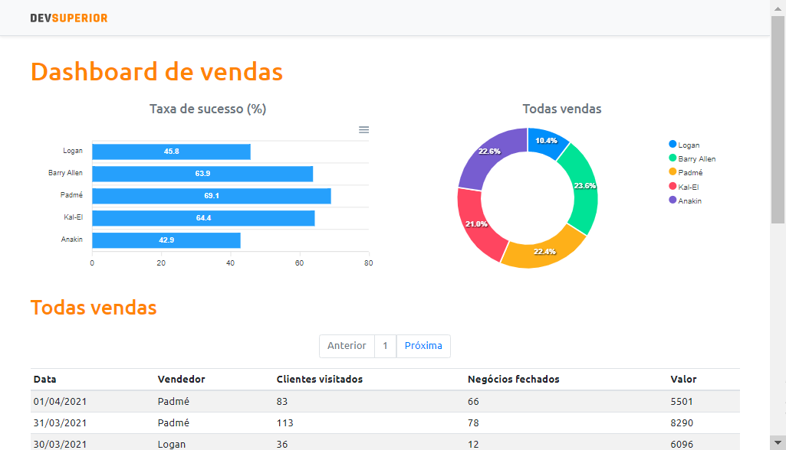

<div align="center">
  <div>
    <h1>DSVendas</h1>
    
    <h3>
      📊 A detailed dashboard about sellers activities of a fictitious company, which includes the number of sales made per day, the success rate and the total income for each.
    </h3>
  </div>

  <p>
    <a href="#-status">Status</a> •
    <a href="#-features">Features</a> • 
    <a href="#%EF%B8%8F-prerequisites">Prerequisites</a> • 
    <a href="#-applied-technologies">Applied technologies</a> • 
    <a href="#-author">Author</a> •
    <a href="#-readme-versions">README versions</a>
  </p>

  <div>
    <a href="https://thiago-dsvendas.netlify.app/">
      </a>
    
    
    
  </div>
</div>

<hr>

### 🏁 Status

<h3 align="center">
	🎉 DSVendas ✔️ Finished 🎉
</h3>

<hr>

### 🏆 Features

- [x] List data related to the daily activities of each seller;
- [x] Paginate the daily data log;
- [x] Calculate and display a bar chart with each seller's success rates; and
- [x] Calculate and display a donut chart with the total income for each seller;

<hr>

### ❗️ Prerequisites

Hey Dev, before starting your tests and / or contributions in the application, it is necessary to have two things installed, the first one is our wonderful GIT and the second, the [Node.js](https://nodejs.org/en/), in addition, of course, to a good text editor.

Well, having everything installed, we can proceed to the step by step of how to run the application.

### 🕹️ Running the application

```bash
# First of all, clone this repo using GIT
$ git clone <https://github.com/trybrito/DSVendas>

# Access the project folder from the command terminal
$ cd .../DSVendas

# Then, go to the frontend folder, which is found inside the project folder
$ cd ./frontend

# Install the package.json dependencies
$ yarn add / npm install

# Run the application
$ yarn dev

# And, finally, go to <http://localhost:3000> to see the application on the local server
```

<hr>

### 🔮 Applied technologies

#### Backend

- [Java](https://www.java.com/pt-BR/)
- [Spring](https://spring.io/)
- [PostgreSQL](https://www.postgresql.org/)

#### Frontend

- [HTML](https://devdocs.io/html/)
- [CSS](https://devdocs.io/css/)
- [Bootstrap](https://getbootstrap.com/)
- [TypeScript](https://www.typescriptlang.org/)
- [React](https://pt-br.reactjs.org/)
- [Axios](https://axios-http.com/)
- [ApexCharts](https://apexcharts.com/)
- [date-fns](https://date-fns.org/)

<hr>

### 👨🏽‍🎓 Author

<div align="center">
  

  <br />
  
  <div>
    <h3>
      🤝 Thiago Raniery Brito
    </h3>
    <p>
      Hey Dev, did you like the application? Well, if you want, feel free to get in touch with me for here or through the tags below.
    </p>
  </div>

  <div>
    <a href="https://www.linkedin.com/in/thiagoranierybrito/">
      </a>
    <a href="mailto:thiagobritotrs@gmail.com">
      </a>
  </div>
</div>

<hr>

### 📚 README versions

<div>
  <a href="https://github.com/trybrito/DSVendas/blob/main/README.md">Portuguese (pt-br)</a>
  |
  <a href="https://github.com/trybrito/DSVendas/blob/main/README-en.md">English (en-us)</a>
</div>
